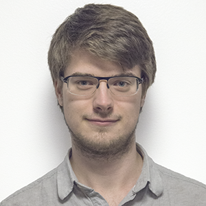

<!-- 
Render using jekyll by running: 
jekyll serve
-->

    

# Mathias Grelck Johnsen
Robotics Engineer, embedded systems and product development

<a href="https://github.com/MathGrelck">GitHub</a>
| <a href="https://www.linkedin.com/in/mathias-grelck-johnsen-8513056a/">LinkedIn</a>

## Summary
Passionate about product development with a strong desire to create intuitive user experiences. Focused on software development for embedded systems in C/C++.

Experienced in simulation and implementation of control systems:

+ Firmware implementation of PID and path-planning control on Atmel XMEGA chipsets in C.
+ Realtime plotting applications for evaluating controller performance written in Python using pySerial, TkInter and QT.
+ SciLab/XCOS and MatLab/Simulink for simulation.

Other embedded endeavors:
+ Customized Bluetooth Low Energy GATT profile for peripheral, supporting simultaneous communication with multiple clients.
+ Power management of embedded system of application processor and peripheral ICs.
+ Debugging of application code and communication protocols IIC and SPI.

Broad skill set within rapid prototyping:

+ App MVPs for mobile platforms in Unity and desktop platforms in Electron.
+ CAD modeling (SolidWorks and Fusion) for both 3D printing and injection molding.

Also been involved with optimizing electronics for passing FCC and CE certifications.

I desire to work on high-impact, larger scale projects with a team of like-minded embedded software engineers. I imagine this collaborative effort will give me a chance to learn from my peers and dive into topics of Continuous Integration and Test Driven Development.

## Experience

`Aug 2018 - Jul 2020`
__Shape Robotics, Robotics Engineer__, full time

I was hired fulltime as Robotics Engineer after receiving my MSc degree in electrical engineering.
Most recently I've worked on the Fable Spin module, where my main contributions are:

+ The design and implementation of the positional and speed control algorithms in firmware on the Atmel XMEGA embedded platform.
+ Specification, test and sourcing of suitable DC gear motors for the Fable Spin drive train.
+ Power optimizations for ultra-low power consumption in standby mode.
+ Specialized testing firmware needed during CE and FCC certification.
+ Some mechanical design from prototype to DFM in SolidWorks.

I also extended the Bluetooth Low Energy capabilities of the Fable Hub firmware with support for multiple clients. Specifically, this enabled the Fable Hub to communicate simultaneously with two devices; a smartphone running the Fable Face app and a tablet running the Fable blockly app.

`Aug 2017 - Jul 2018`
__Shape Robotics, Student Developer__, part time

I created:
+ Software tools for internal use in production.
+ The Fable Face mobile app for iOS and Android using Unity.
+ Firmware for the Fable Hub to enable Bluetooth communication with the Fable Face app.

`Aug 2015 - Jul 2017`
__DTU Center for Playware, Student Developer__, part time

I was the first hire at Shape Robotics back in the summer of 2015, when “Fable” was a research project at DTU, lead by David Johan Christensen and Moises Pacheco. During my time as a student developer I helped:
+ Transform the PC software of the research project into a standalone application for release on both Windows and macOS.
+ Produce more than 40 prototypes of the Fable Joint and Fable Hub.
+ Test the Fable system in schools around Zealand.

## Education

`Sep 2012 - Jul 2018`
__Technical University of Denmark__, Copenhagen

Master of Science, Electrical Engineering in Automation and Robot Technology.

`Sep 2008 - Jul 2011`
__Egaa Gymnasium__, Aarhus

High school education in Mathematics, Physics and Music.

## Volunteer work

`Sep 2012 - Jul 2015`
__IAESTE Denmark, PR Coordinator__, part time

My responsibilities include designing, printing and content managing and creation of the annual IAESTE Denmark PR material.

## Activities
Most vacations spent enjoying food and road cycling in France with my girlfriend and family. La Pavoni coffee brewing and latte art practicing, various fermentation projects, enjoying my vinyl collection. Yes, my friends have suggested that I take "Hipster" as my middle name.

